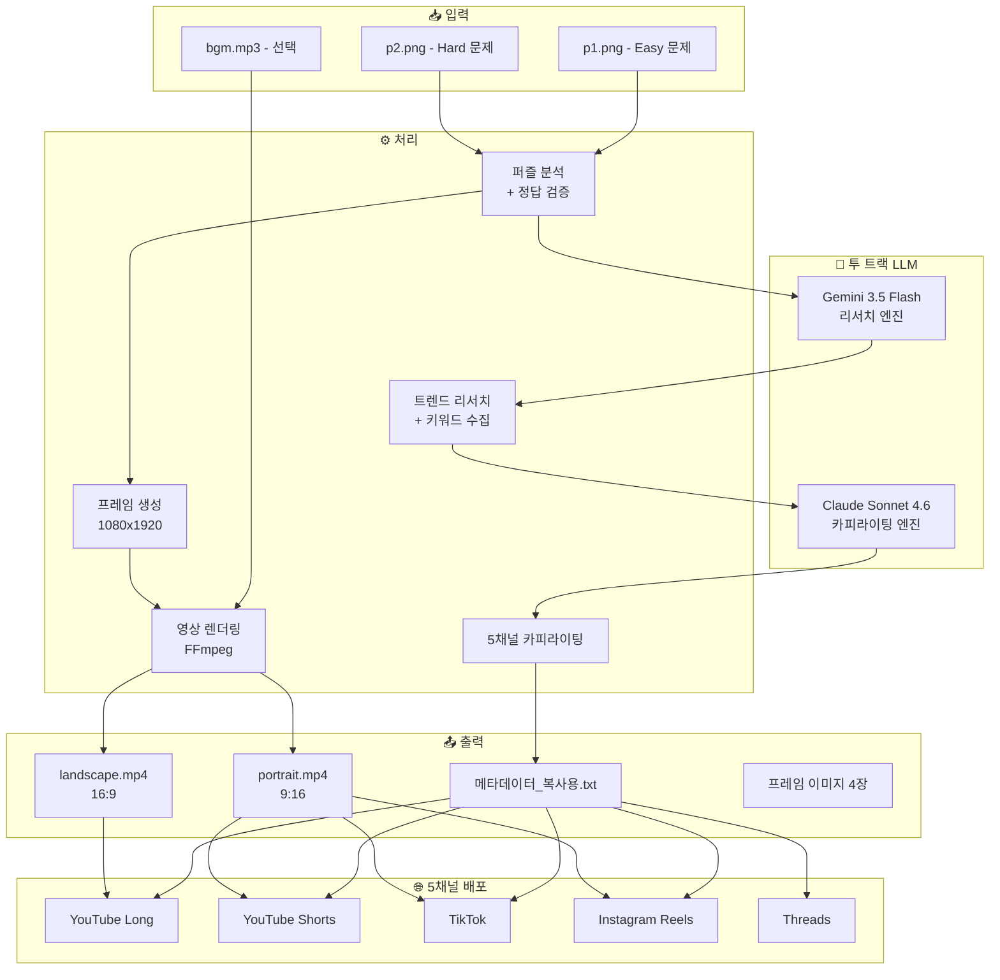

# ARCHITECTURE.md — 시스템 아키텍처 및 기술 스택

> IQ Spark Studio의 전체 시스템 구성, 데이터 흐름, 기술 스택 및 선택 이유를 문서화합니다.

## 1. 시스템 전체 구성도



## 2. 투 트랙 LLM 아키텍처

### 2.1 아키텍처 개요

```
┌─────────────────────────────────────────────────────┐
│                투 트랙 LLM 파이프라인                  │
│                                                     │
│  ┌──────────────────┐    JSON    ┌────────────────┐ │
│  │  Track 1: Gemini │  인사이트   │ Track 2: Claude│ │
│  │  ──────────────  │ ────────→  │ ──────────────│ │
│  │  • 트렌드 리서치  │            │ • 훅킹 제목    │ │
│  │  • 키워드 분석    │            │ • 캡션 작성    │ │
│  │  • 정책 리서치    │            │ • 디스크립션   │ │
│  │  • 이미지 분석    │            │ • 해시태그     │ │
│  │  • 정답 도출      │            │ • 고정 댓글    │ │
│  └──────────────────┘            └────────────────┘ │
└─────────────────────────────────────────────────────┘
```

### 2.2 각 엔진 상세

| 구분 | Track 1: Gemini 3.5 Flash (medium) | Track 2: Claude Sonnet 4.6 (thinking) |
|------|---------------------|----------------------|
| **역할** | 리서치 + 분석 | 카피라이팅 |
| **입력** | 퍼즐 이미지, 검색 쿼리 | Gemini JSON 인사이트 |
| **출력** | analysis.json, trend_report.json | copy_5platform.json |
| **비용** | $0 (무료 티어) | ~$3~5/월 |
| **선택 이유** | 이미지 분석 우수, 실시간 웹 검색, 무료 | 카피 품질 최고, 톤 일관성 |

### 2.3 데이터 흐름 (JSON 인터페이스)

```
Gemini → analysis.json
         ├── puzzle_type: "pattern_recognition"
         ├── difficulty: "medium"
         ├── answer: "C"
         ├── verification: {forward, backward, alternative}
         └── confidence: 0.95

Gemini → trend_report.json
         ├── trending_keywords: [...]
         ├── optimal_posting_time: "..."
         └── competitor_analysis: {...}

Claude → copy_5platform.json
         ├── youtube_long: {title, description, tags, pinned_comment}
         ├── youtube_shorts: {title, description, hashtags}
         ├── tiktok: {caption, hashtags, ai_label}
         ├── instagram_reels: {caption, hashtags}
         └── threads: {text, hashtags}
```

## 3. 6프레임 쇼츠 구조 및 세부 타이밍

```
┌─────────┐   ┌─────────┐   ┌─────────┐   ┌─────────┐   ┌─────────┐   ┌─────────┐
│ Frame 1 │──→│ Frame 2 │──→│ Frame 3 │──→│ Frame 4 │──→│ Frame 5 │──→│ Frame 6 │
│  Intro  │   │   Q1    │   │   A1    │   │   Q2    │   │Comment  │   │  Final  │
│         │   │(Reveal) │   │(해설)   │   │(Comment)│   │  CTA    │   │  CTA    │
│ Hook 훅 │   │ Easy    │   │ 정답공개│   │ Hard    │   │정답미공 │   │사이트   │
│ 문구    │   │ A,B,C,D │   │         │   │ A,B,C,D │   │개+유도  │   │유도카드 │
└─────────┘   └─────────┘   └─────────┘   └─────────┘   └─────────┘   └─────────┘
    ~4s           ~24s          ~4s           ~24s          ~2s           ~2s
                               = 총 60초 정확히
```

## 4. 파일 시스템 구조

```
reports/YYYYMMDD/
├── input/               ← 대표님 원본 (읽기 전용)
│   ├── p1.png           ← Easy 문제
│   ├── p2.png           ← Hard 문제
│   └── bgm.mp3          ← 배경음악 (선택)
├── frames/              ← 브랜드 프레임 4장
│   ├── problem_p1.png
│   ├── answer_a1.png
│   ├── problem_p2.png
│   └── cta_frame.png
├── youtube_long/        ← 16:9 영상 + metadata.json
├── youtube_shorts/      ← 9:16 영상 + metadata.json
├── tiktok/              ← 9:16 영상 + metadata.json
├── instagram_reels/     ← 9:16 영상 + metadata.json
├── threads/             ← 텍스트+이미지 metadata.json
├── analysis.json        ← 퍼즐 분석 결과
├── trend_report.json    ← 트렌드 리서치 결과
├── copy_5platform.json  ← 5채널 카피
└── 메타데이터_복사용.txt  ← 5채널 카피 (복사·붙여넣기용)
```

## 5. 기술 스택

| 레이어 | 기술 | 버전/사양 | 선택 이유 |
|--------|------|----------|----------|
| **프론트엔드** | HTML/CSS/JS | 순수 정적 | 서버 불필요, 즉시 실행 |
| **이미지 캡처** | html2canvas | Latest | 프레임 → PNG 변환 |
| **오디오** | Web Audio API | 브라우저 내장 | 60초 재생 + 페이드 제어 |
| **영상 렌더링** | ffmpeg.wasm + FFmpeg CLI | v0.12+ (WASM) / CLI 4.x+ | 브라우저 내 원클릭 MP4 렌더링 + 로컬 고속 배치 렌더링 이중화 |
| **리서치 LLM** | Gemini 3.5 Flash (medium) | API | 고속 + 이미지 분석 + 비용 효율 |
| **카피 LLM** | Claude Sonnet 4.6 (thinking) | API | 심층 추론 카피 품질 최고 |
| **이미지 분석** | Claude Vision | API | 퍼즐 이미지 파싱 |
| **트렌드 수집** | Firecrawl MCP | MCP Server | 키워드/정책 리서치 |
| **이력 관리** | Memory MCP | MCP Server | 해시태그/성과 이력 |

## 6. 향후 확장 아키텍처 (SaaS 전환 시)

```
┌─────────────────────────────────────────────────┐
│              SaaS 전환 아키텍처 (미래)            │
│                                                 │
│  Frontend: React/Next.js                        │
│  Auth: Supabase Auth                            │
│  DB: Supabase PostgreSQL                        │
│  Storage: AWS S3                                │
│  Serverless: AWS Lambda                         │
│  Automation: n8n Cloud                          │
│  Hosting: Vercel                                │
│                                                 │
│  ※ 현재는 불필요. 팀 확장 또는 SaaS 판매 시 도입 │
└─────────────────────────────────────────────────┘
```

---

*ARCHITECTURE.md — Last updated: 2026-07-06*
